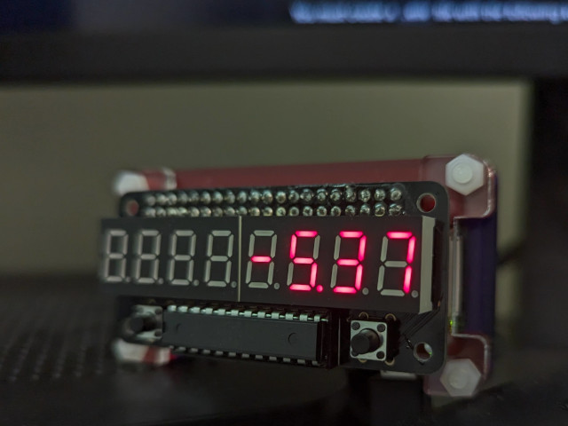

# collimater

Keep yourself on track, with meetings alignment status.



## Installation

Clone the repo to the target machine (or copy the relevant files with `scp`)

### Configuration

You must create a `.env` file with the following keys:

```bash
# Full HTTPS url to your shared calendar
COLLIMATER_ICS_URL=https://outlook.office365.com/.../calendar.ics
```

### Dependencies

Create a virtual environment with `python3 -m venv .venv`. You may need to `sudo apt-get install python3-venv` first.

Run `pip install -r requirements.txt` to install dependencies (generated from the `pdm` lockfile with `./scripts/export-requirements.sh`)

### System setup

Copy the provided `collimater.service` file to `/etc/systemd/system/collimater.service` and update the contents to reference your local installation.

Copy the provided `collimater.logrotate` file to `/etc/logrotate.d/collimater` and update with your preferred settings.
